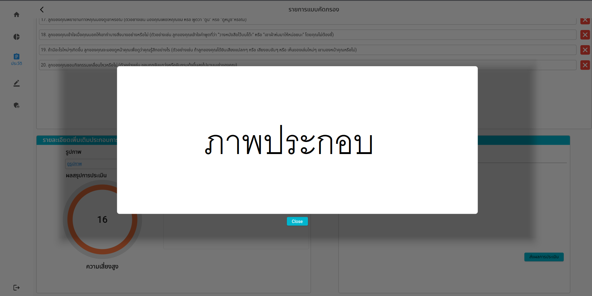

# การประเมินพัฒนาการ

ในหน้านี่จะแสดงถึงข้อมูลเบื้องต้นของผู้ปกครองของบุตร, บุตร, คำตอบในแบบคัดกรอง, ความเสี่ยง และข้อความบันทึกทที่ผู้ปกครองส่งถึงหมอ

โดยขั้นแรก ระบบจะแสดงตารางข้อมูลซึ่งแบ่งเป็นสองประเภท ได้แก่ รายการแบบคัดกรอง คือตารางที่แสดงถึงรหัสผู้ใช้งานที่ยังอยู่ในสถานะรอการประเมินจากทางแพทย์ โดยสามารถเข้าไปประเมิณได้โดยกดปุ่ม ‘รอประเมิณ’

และยังสามารถดูประวัติที่ประเมินไปแล้วได้โดยการคลิกที่ปุ่ม “ประเมินแล้ว” 

หลังจากที่คลิกเข้าไปที่กล่อง “รอประเมิน” แล้ว ระบบจะแสดงหน้าต่างของบุตรของผู้ใช้งาน ซึ่งจะแสดงข้อมูลต่างๆเช่น รหัสผู้ใช้งาน รหัสบุตร และวันที่ประเมิน 	ซึ่งถ้าต้องการที่จะประเมิน ให้เลือกบุตรของผู้ใช้งานโดยกดปุ่ม “รอประเมิน”

หลังจากที่เลือกบุตรของผู้ใช้งานเพื่อที่จะประเมินแล้ว ระบบจะแสดงหน้าต่างนี้ขึ้นมา

หน้าต่างนี้จะแสดงข้อมูลต่างๆของผู้ใช้งานเช่น ข้อมูลบุตร ข้อมูลผู้ปกครอง ข้อมูลแบบสอบถาม คะแนนหลังจากสำเร็จแบบทดสอบ รูปภาพและข้อมูลที่ผู้ใช้งานส่งมา และกล่องที่ไ้ว้สำหรับใส่คำประเมิน โดยผู้ใช้งานสามารถตรวจสอบรูปภาพได้ที่ปุ่ม “ดูรูปภาพ”

โดยรูปภาพจะแสดงขึ้นมาดังรูป โดยผู้ใช้งานสามารถคลิกที่ตรงไหนก็ได้นอกรูปภาพ หรือปุ่ม close เพื่อทำการปิดรูปภาพ

ผู้ใช้งานสามารถตรวจสอบข้อมูลของบุตรเพิ่มเติมได้ โดยการกดที่ปุ่ม “ข้อมูลทางการแพทย์เพิ่มเติม” 

ระบบจะแสดงข้อมูลทางการแพทย์เพิ่มเติมขึ้นมา โดยข้อมูลจะประกอบด้วย ข้อมูลการคลอดบุตร และข้อมูลพัฒนาการของบุตร

บุคลากรทางการแพทย์สามารถที่จะประเมินและให้ข้อมูลกับผู้ใช้งาน โดยใส่ข้อความประเมิณลงในส่วนของ ‘ประเมิณ’ และกดส่งผลการประเมินให้กับผู้ใช้งานที่ปุ่มส่งผลการประเมิน	

