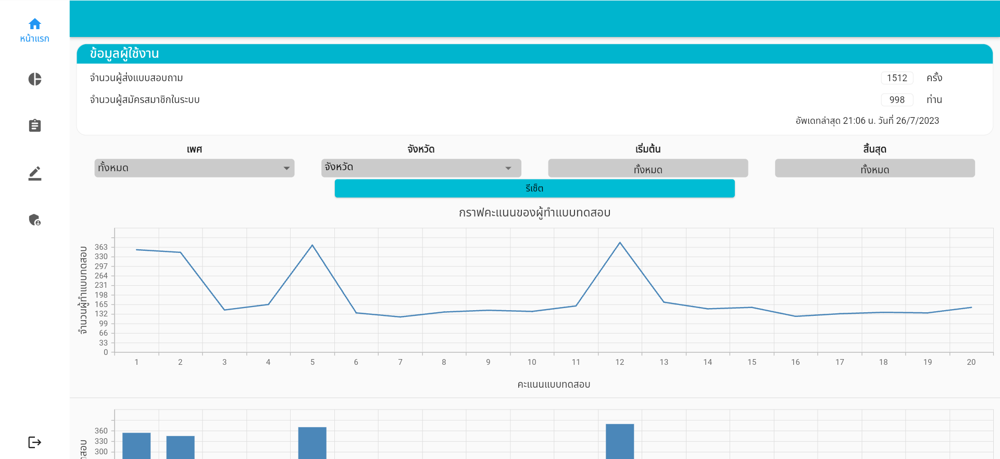
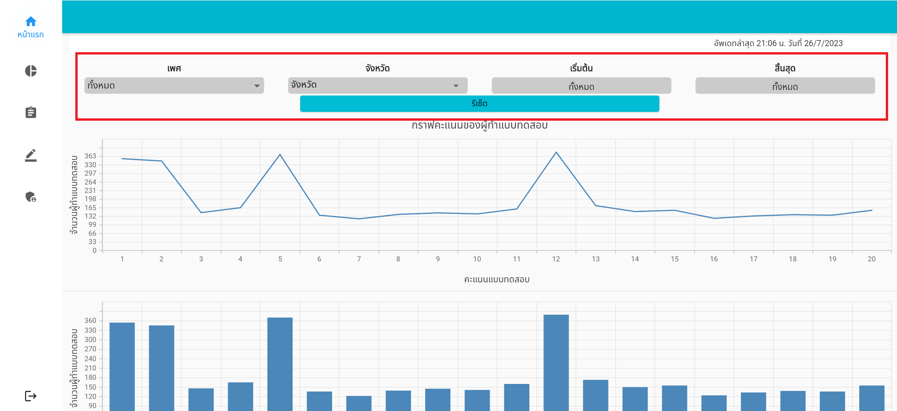

# หน้าแรก

ในหน้านี้จะแสดงถึงจำนวนข้อมูลผู้ใช้งานในระบบ และจำนวนแบบคัดกรองที่ส่งเข้ามาในระบบ และมีแผนภูมิแท่งและแผนภูมิเส้น ที่แสดงสถิติระดับความเสี่ยงของบุตรที่ผู้ใช้งานได้ทำแบบคัดกรอง

ผู้ใช้งานสามารถกรองประเภทที่ต้องการที่จะเลือกได้ โดยสามารถกรองเพศ, จังหวัด, และช่วงเวลาได้ ซึ่งหากไม่ต้องการที่จะกรอง สามารถคลิกที่ปุ่มรีเซ็ตได้ โดยระบบจะทำการย้อนค่ากลับไปที่ค่าเริ่มต้น

