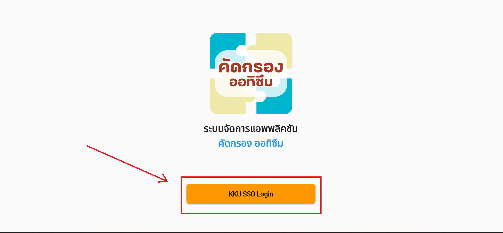
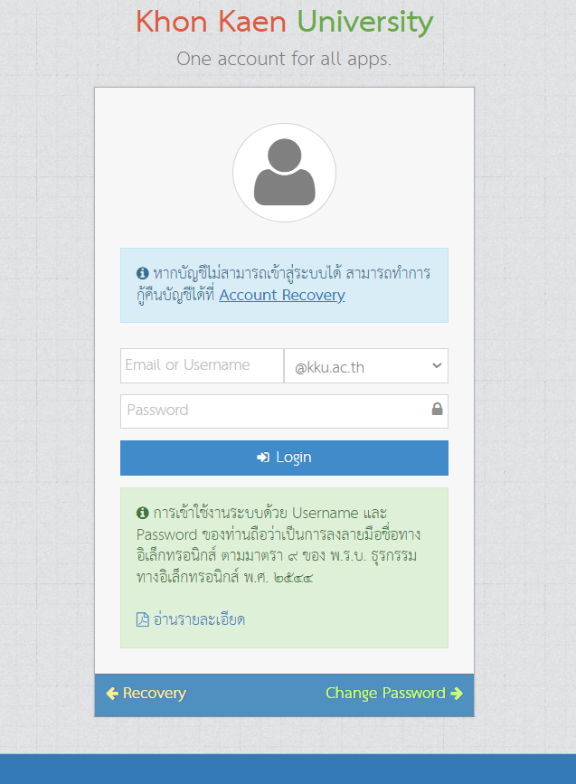

# การเข้าสู่ระบบ

- การเข้าสู่ระบบสามารถทำได้ด้วยการเข้าสู่ระบบด้วยอีเมลของมหาลัย โดยการใช้ kkumail หรือ kku.ac.th โดยหลังจากการเข้าสู่ระบบแล้ว 
หากไม่ได้รับมอบสิทธิการเข้าถึงจากผู้ดูแลระบบ จะไม่สามารถเข้าใช้งานระบบได้
- การมอบสิทธิการใช้งาน จะต้องเป็นเจ้าหน้าที่ที่ได้รับสิทธิผู้ดูแลระบบเท่านั้นจึงจะสามารถมอบสิทธิการเข้าถึงของแอพลิเคชันจัดการแบบคัดกรองได้

## การเข้าสู่ระบบด้วยอีเมลของมหาวิทยาลัย

คลิกไปที่ KKU SSO Login

หลังจากนั้นใส่ Username และ password ที่ทางสำนักเทคโนโลยีออกให้

หลังจากนั้นระบบจะพาผู้ใช้งานไปที่หน้าแรกของแอพลิเคชัน