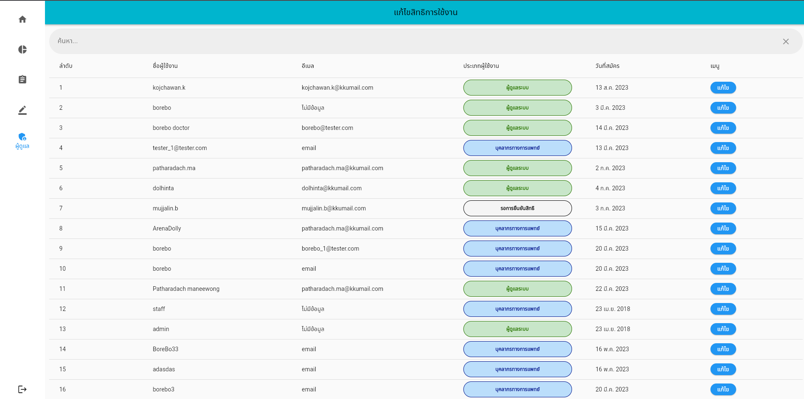
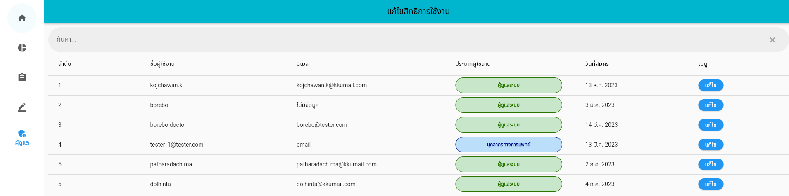
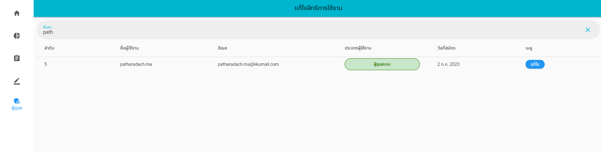
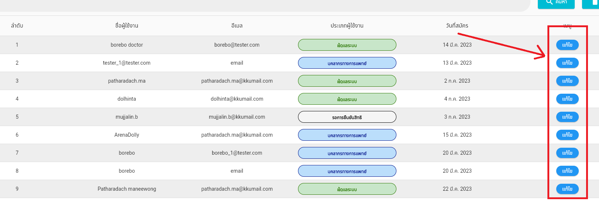
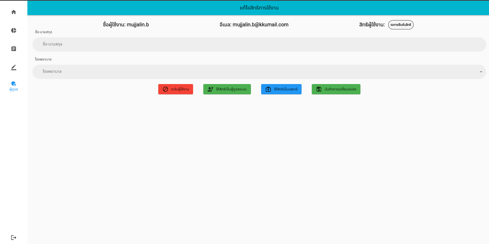
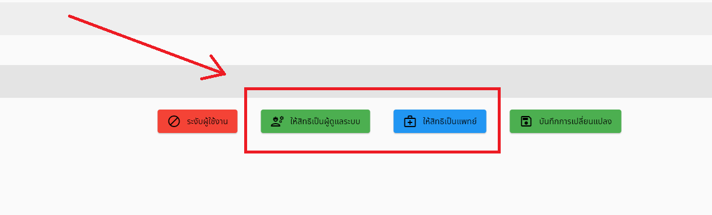
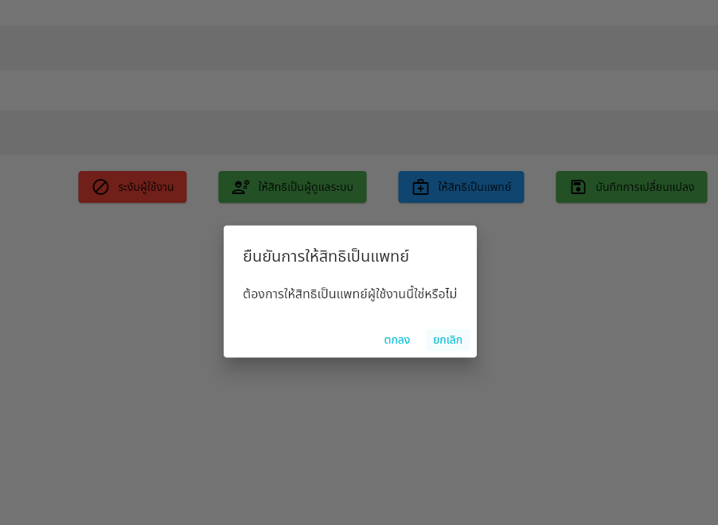

# การปรับสิทธิการเข้าถึงแอปจัดการ

หน้าต่างนี้คือระบบที่ผู้ดูแลระบบสามารถให้สิทธิผู้ใช้งานขั้นต่างๆ และระงับการใช้งานของผู้ใช้งานแอพลิเคชันจัดการแบบคัดกรองได้ ซึ่งจะประกอบไปด้วย ลำดับ ชื่อผู้ใช้งาน อีเมล ประเภทผู้ใช้งาน และวันที่สมัครดังรูป

โดยผู้ดูแลระบบสามารถค้นหาชื่อที่ต้องการได้จากกล่องการค้นหาด้านบน

สามารถค้นหาชื่อได้โดยการใช่อีเมลในการค้นหา

เมื่อพบผู้ใช้งานที่ต้องการแล้ว ผู้ดูแลระบบสามารถที่จะแก้ไขสิทธิของผู้ใช้งานโดยการกดที่ปุ่ม  “แก้ไข”

หลังจากเข้าสู่หน้าต่างแก้ไขสิทธิการใช้งาน ผู้ดูแลระบบจำเป็นที่จะต้องกรอก ชื่อ-นามสกุล และโรงพยาบาล หากเข้าใช้งานเป็นครั้งแรก และยังสามารถมอบสิทธิการใช้งานเป็นบุคลากรทางการแพทย์ ให้สิทธิเป็นผู้ดูแลระบบ หรือระงับผู้ใช้งานได้ ดังรูป

หากต้องการให้สิทธิให้กดที่ปุ่ม “ให้สิทธิเป็นผู้ดูแลระบบ” หรือ “ให้สิทธิเป็นแพทย์”

หลังจากนั้นระบบจะแสดงข้อความเพื่อยืนยันที่จะเปลี่ยนสิทธิผู้ใช้งาน หากกดยืนยันระบบจะบันทึกและกลับไปที่หน้าตารางสิทธิผู้ใช้งาน

