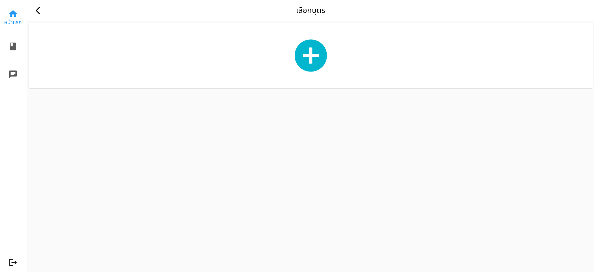
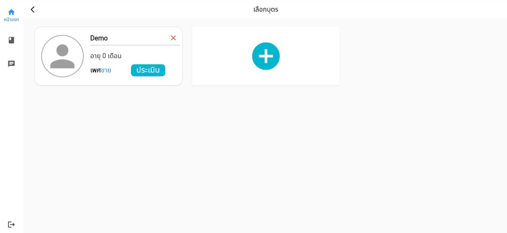
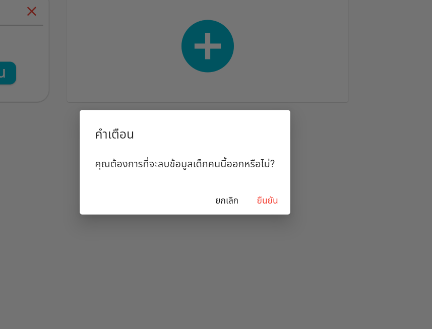

# การเพิ่มบุตรเพื่อทำแบบทดสอบ

ก่อนที่ผู้ใช้งานจะทำแบบคัดกรองนั้น ผู้ใช้งานจำเป็นที่จะต้องเพิ่มข้อมูลบุตรอย่างน้อยหนึ่งคนที่ต้องการจะประเมินด้วยแบบคัดกรอง โดยกดที่เครื่องหมายบวกดังรูป

หลังจากนั้นระบบจะแสดงหน้าถัดไป โดยผู้ใช้งานจำเป็นที่จะต้องกรอกข้อมูลให้ครบถ้วน<b>ทุกช่อง</b> โดยรูปภาพผู้ใช้งานสามารถเลือกที่จะใส่หรือไม่ใส่ก็ได้

หลังจากที่เพิ่มข้อมูลบุตรเสร็จแล้ว จะมีกล่องที่มีข้อมูลดังรูปด้านล่าง โดยจะแสดงข้อมูลชื่อ เพศ อายุ และรูปภาพ(หากต้องการระบุ)

หลังจากนั้น ผู้ใช้งานสามารถคลิกที่ปุ่มประเมินเพื่อทำแบบทดสอบ

หากผู้ใช้งานสามารถลบข้อมูลบุตรที่อาจจะเกิดจากความผิดพลาดในการสร้าง หรือใส่ข้อมูลผิดได้ โดยการกดที่เครื่องหมายกากบาท ด้านบนขวาของกล่อง หลังจากนั้น ระบบจะขึ้นแจ้งเตือนมา ให้กดยืนยัน

หลังจากนั้นข้อมูลของบุตรดังกล่าวจะถูกลบออก รวมทั้งข้อมูลจากแบบทดสอบที่ส่งไปให้แพทย์ประเมินเช่นกัน

