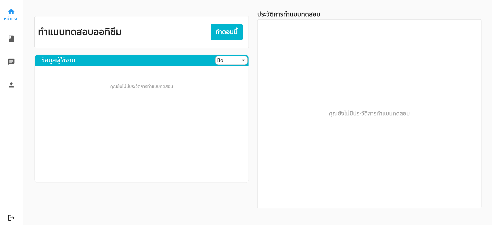
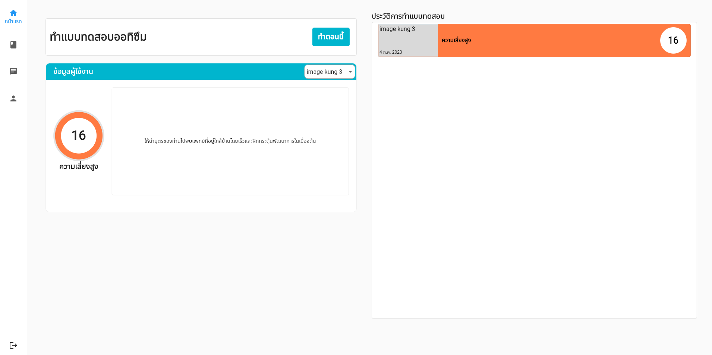
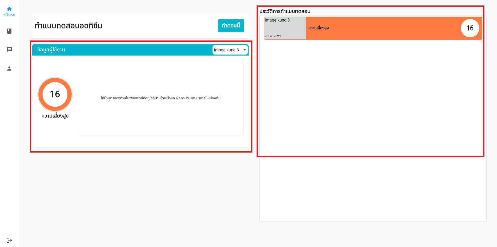
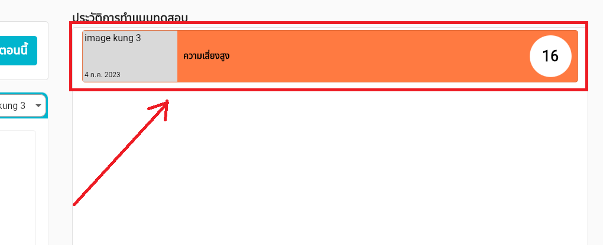
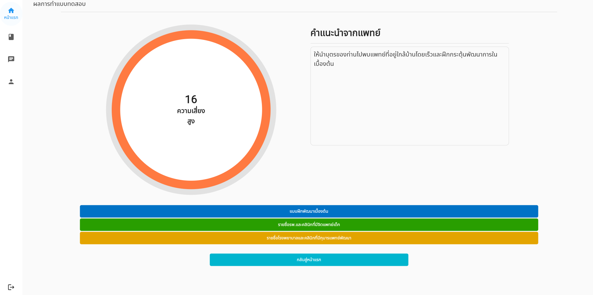

# หน้าแรก

เมื่อสมัครเข้ามาในระบบครั้งแรกหน้าต่างของแอปจะระบุดังรูป

โดยหน้าแรก จะประกอบไปด้วย 2 ส่วนหลัก

### ส่วนที่หนึ่ง ส่วนของแบบคัดกรอง

เมื่อผู้ใช้งานกดปุ่มทำแบบทดสอบออทิซึม ระบบจะนำผู้ใช้งานเข้าสู่หน้าถัดไปคือหน้าเลือกบุตรที่ต้องการที่จะคัดกรองโดยแบบคัดกรอง 

### ส่วนที่สอง ส่วนของการแสดงประวัติการทำแบบคัดกรอง

โดยจะแสดงเป็นประวัติการทดสอบหากผู้ใช้งานได้ทำแบบทำสอบเสร็จสิ้นอย่างน้อย 1 ครั้ง หลังจากทำการใส่ข้อมูลบุตรและทำแบบคัดกรองแล้ว จะมีผลการทำแบบคัดกรอง วัน เวลา และคะแนน โดยจะแสดงในกล่องทางขวา และในส่วนกล่องทางซ้ายนั้นจะแสดงผลการทำแบบคัดกรองที่คะแนนสูงที่สุด และสามารถเปลี่ยนบุตรที่ต้องการจะตรวจสอบประวัติได้

หากต้องการตรวจสอบคำแนะนำเพิ่มเติมสามารถกดที่กล่องแต่ละกล่องที่ช่องประวัติการทำแบบทดสอบได้

โดยหลังจากที่ผู้ใช้งานกดเข้าไป ระบบจะแสดงหน้าจอความเสี่ยงและคำแนะนำดังรูป

