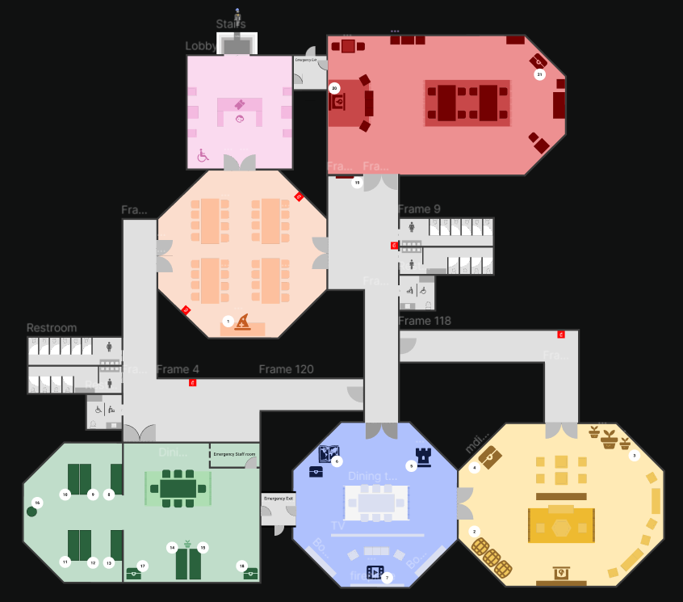

# ฝั่งผู้ใช้งานทั่วไป

แอพลิเคชันเพื่อคัดกรองบุตรที่มีความเสี่ยงเป็นออทิซึม

## เกี่ยวกับแอพลิเคชันออทิซึม

Nowadays, several children are diagnosed with Autism. This project will develop two applications which are a mobile application and a web application. The mobile application will help parents interview their child with a risk of being autistic or not. This application will allow parents to promptly investigate their child's chances of being autistic to prepare for treatment. This application contains a 20-question questionnaire for parents and children to complete, and there will be feedback about the opportunity and statistical results gathered from many children and the parent. Also send the information of the result from each child to experts to analyze and send advice back to the parent.

ทดสอบรูปภาพ


### What you'll need

- [Node.js](https://nodejs.org/en/download/) version 16.14 or above:
  - When installing Node.js, you are recommended to check all checkboxes related to dependencies.

## Generate a new site

Generate a new Docusaurus site using the **classic template**.

The classic template will automatically be added to your project after you run the command:

```bash
npm init docusaurus@latest my-website classic
```

You can type this command into Command Prompt, Powershell, Terminal, or any other integrated terminal of your code editor.

The command also installs all necessary dependencies you need to run Docusaurus.

## Start your site

Run the development server:

```bash
cd my-website
npm run start
```

The `cd` command changes the directory you're working with. In order to work with your newly created Docusaurus site, you'll need to navigate the terminal there.

The `npm run start` command builds your website locally and serves it through a development server, ready for you to view at http://localhost:3000/.

Open `docs/intro.md` (this page) and edit some lines: the site **reloads automatically** and displays your changes.
