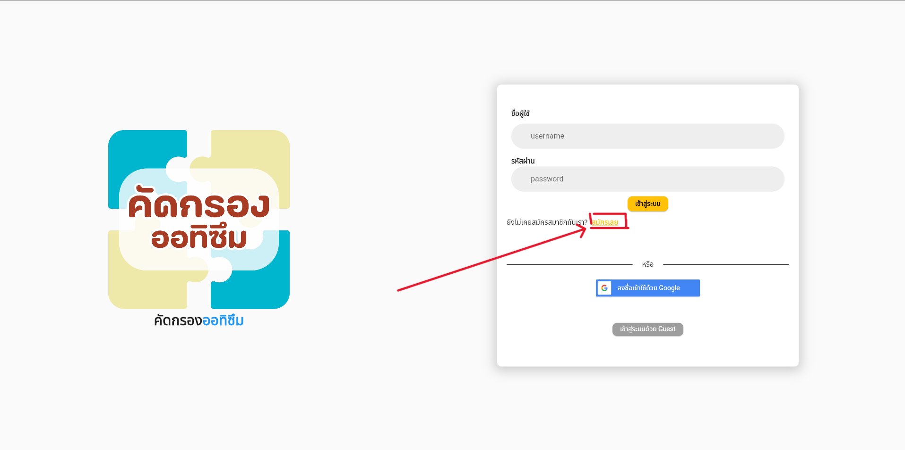
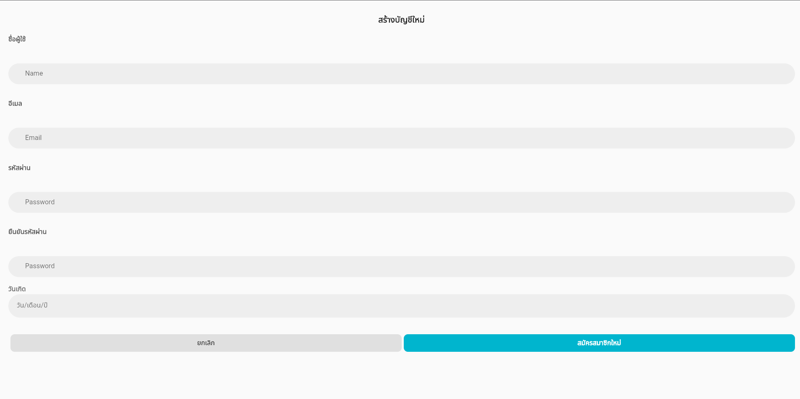
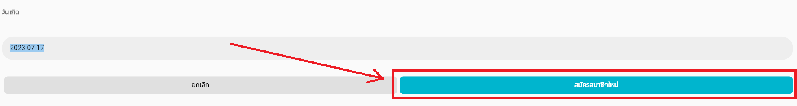
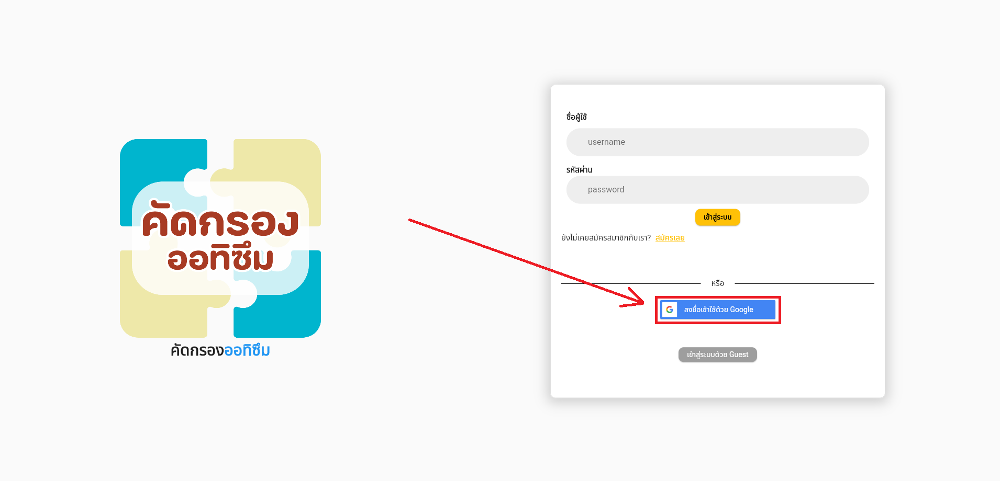
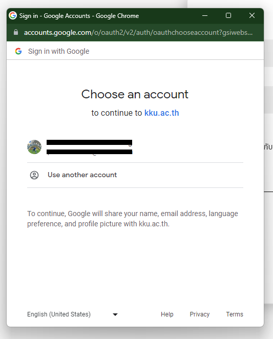
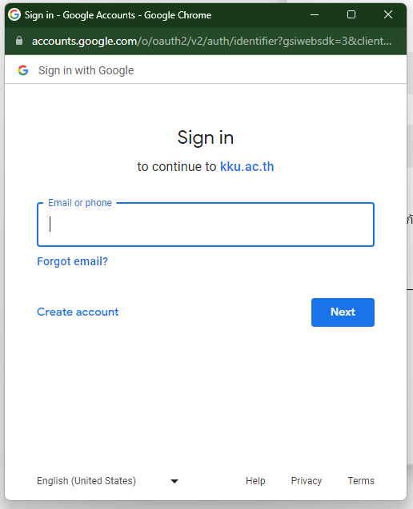
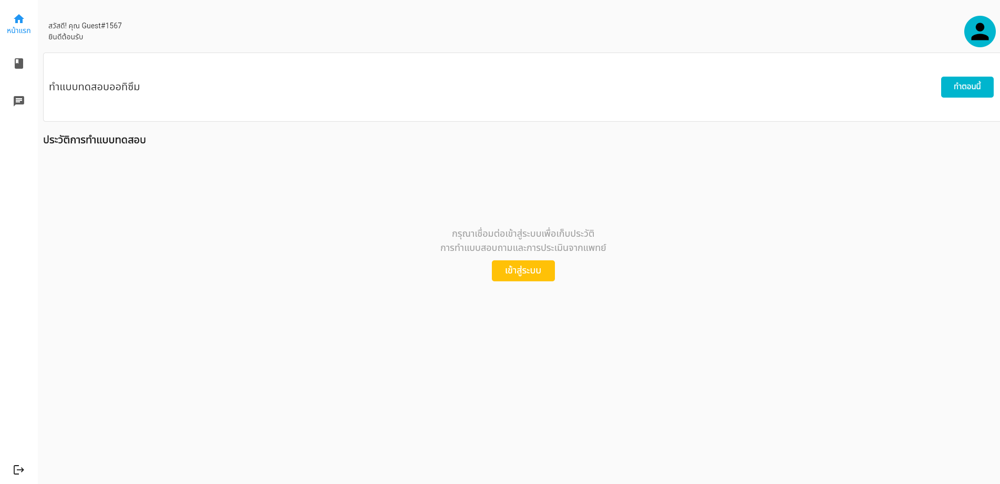

# การเข้าสู่ระบบและการออกจากระบบ

ผู้ใช้สามารถเข้าสู่ระบบได้ 3 รูปแบบ

## การเข้าสู่ระบบด้วย อีเมล และ รหัสผ่าน

หากผู้ใช้งาน ไม่มีบัญชีผู้ใช้งาน ผู้ใช้สามารถสมัครบัญชีใหมได้ โดยเข้าไปที่สมัคสมาชิก

หลังจากนั้นผู้ใช้จำเป็นต้องกรอกข้อมูลต่างๆ เช่น ชื่อผู้ใช้งาน อีเมล รหัสผ่าน ยืนยันรหัสผ่าน และวันเดือนปีเกิด ดังรูปภาพด้านล่าง

และกรอกข้อมูลให้ครบทุกช่อง โดยที่รหัสผ่าน ต้องมีความยาวอย่างน้อย 6 ตัวอักษร หลังจากนั้นคลิกที่ "สมัครสมาชิกใหม่"

หลังจากนั้น ระบบจะพาคุณเข้าสู่หน้าแรกของแอพพลิเคชัน

## การเข้าสู่ระบบด้วย Gmail

ผู้ใช้งานที่ต้องการเข้าระบบผ่าน Google สามารถคลิกที่ปุ่มดังนี้ได้

หลังจากที่คลิกแล้วจะมีป๊อปอัพขึ้นมา หากเคยเข้าสู่ระบบด้วย Google แล้วให้เลือก Accout เดิมหรือเปลี่ยน Account ตามภาพดังนี้

หากผู้ใช้งานเข้าสู่เว็ปไซต์ครั้งแรก ผู้ใช้งานต้องกรอก Gmail และ รหัสผ่านของท่านเพื่อเข้าสู่ระบบ

## การเข้าสู่ระบบด้วยผู้ใช้งานชั่วคราว หรือ Guest

หากผู้ใช้งานต้องการเข้าสู่ระบบโดยที่ไม่เก็บประวัติการใช้งาน ผู้ใช้งานสามารถเข้าสู่ระบบโดยไม่ต้องกรอกข้อมูลใดๆ ทั้งสิ้น โดยเลือกที่ปุ่มดังนี้

หลังจากนั้นระบบจะพาไปที่หน้าแรกของแอพพลิเคชัน

## การออกจากระบบ

หากผู้ใช้งานต้องการออกจากระบบ สามารถทำได้ด้วยกันสองวิธี ได้แก่

การกดที่ปุ่มขวาล่างเพื่อออกจากระบบ

หรือเข้าไปที่หน้าโปรไฟล์โดยคลิกที่นี่

และคลิกที่ปุ่ม "ออกจากระบบ"

