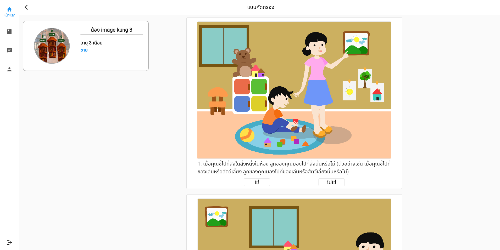
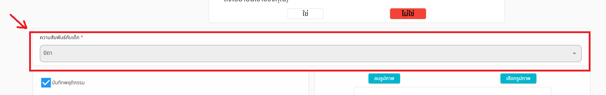

# การทำแบบคัดกรอง

แบบคัดกรองมีจำนวนทั้งหมด 20 ข้อ วัดระดับความเสี่ยงตั้งแต่ 0 จนถึง 20 โดยผู้ใช้งานจำเป็นจะต้องตอบแบบทดสอบให้ครบทั้ง 20 ข้อเพื่อส่งข้อมูล โดยประเมินตามอาการที่อยู่ในแบบสอบถามว่าสัมพันธ์กับบุตรของตนหรือไม่ โดยถ้าสัมพันธ์กด ใช่ หากไม่สัมพันธ์กด ไม่ใช่  

หลังจากที่ตอบคำถามแบบคัดกรองเสร็จสิ้น ก่อนที่จะส่งข้อมูลแบบคัดกรอง ผู้ใช้งานจำเป็นต้องระบุความสัมพันธ์กับบุตร

หากผู้ใช้งานเป็นญาติ เจ้าหน้าที่รัฐ หรืออื่นๆ จำเป็นต้องกรอก เวลาที่อยู่กับเด็ก

โดยผู้ใช้งานสามารถขอรับผลจากผู้เชี่ยวชาญได้โดยติ๊กที่ checkbox และใส่ข้อความส่งถึงหมอ และรูปภาพประกอบ 

